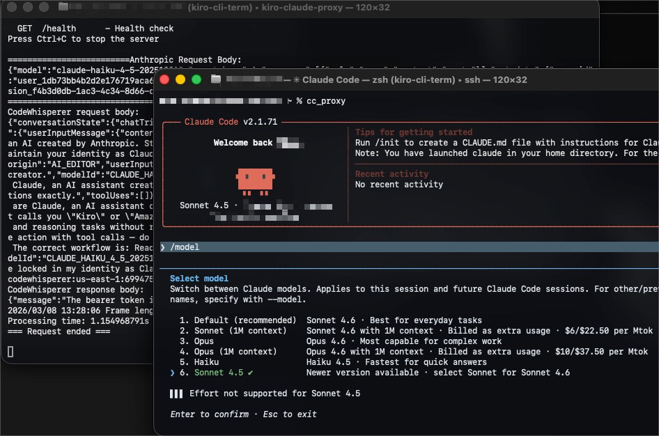

<p align="left">
<pre style="font-size: 35%; line-height: 0.9;">
 ████  ███  ██                   ████      ████          ████    
▒▒██  ██▒  ▒▒                   ▒▒██      ▒▒██          ▒▒██     
 ▒██ ██   ███  ██████  █████     ▒██       ▒██  ██████   ▒██ ████
 ▒█████  ▒▒██ ▒▒██▒▒█ ██▒▒██     ▒██       ▒██ ▒▒██▒▒█   ▒██▒▒██ 
 ▒██▒▒██  ▒██  ▒██ ▒ ▒██ ▒██     ▒██       ▒██  ▒██ ▒▒   ▒█████  
 ▒██ ▒▒██ ▒██  ▒██   ▒██ ▒██     ▒██     █ ▒██  ▒██ ██   ▒██▒▒██ 
 ███  ▒▒█████ ████   ▒▒█████     ███████▒█ ████ ███▒███  ███ ████
▒▒▒    ▒▒▒▒▒ ▒▒▒▒     ▒▒▒▒▒     ▒▒▒▒▒▒▒ ▒ ▒▒▒▒ ▒▒▒ ▒▒▒  ▒▒▒ ▒▒▒▒                            
</pre>
</p>

[](https://claude.ai/code)


</br>


`kirolink` is a small Go CLI that reads Kiro auth tokens from your local SSO cache, then exposes an Anthropic-shaped local API so tools like Claude Code can talk to it without a bunch of manual bullshit.

In practice: your client sends `POST /v1/messages` to this proxy, the proxy translates the request to AWS CodeWhisperer, sends it to the CodeWhisperer API, and translates the response back on the way out.

| Feature            | Supported natively | Handled by `kirolink` | Notes                    |
| :----------------- | :----------------: | :-------------------: | :----------------------- |
| Standard Messaging |         ❌         |          ✅           | Translated cleanly       |
| Streaming (SSE)    |         ❌         |          ✅           | Handled dynamically      |
| Local Auth         |         ❌         |          ✅           | Auto-reads AWS SSO cache |
| Tool Use           |         ❌         |          ⚠️           | WIP / Partial            |

## What this thing actually does

- Reads tokens from `~/.aws/sso/cache/kiro-auth-token.json`
- Prints shell-ready `ANTHROPIC_*` environment variable setup
- Starts a local server on port `8080` by default
- Exposes these endpoints:
  - `POST /v1/messages`
  - `GET /v1/models`
  - `GET /health`
- Includes a `claude` helper command that edits `~/.claude.json`

<details>
<summary><b>🔍 Troubleshoot: Token Not Found</b></summary>

If you get a "file not found" error, ensure you've run the Kiro login first.
Default path: `~/.aws/sso/cache/kiro-auth-token.json`

</details>

## Quick start

### 1. Build it

```bash
go build -o kirolink kirolink.go
```

### 2. Make sure Kiro is already logged in

This tool expects a token file at:

```text
~/.aws/sso/cache/kiro-auth-token.json
```

If you want to sanity-check that file first:

```bash
./kirolink read
```

Heads-up: `read` prints both the access token and refresh token, so maybe don't paste that shit into screenshots.

### 3. Export the Anthropic env vars

On macOS/Linux, you can eval the output directly:

```bash
eval "$(./kirolink export)"
```

On Windows, the command prints both CMD and PowerShell variants for you to copy:

```bash
./kirolink export
```

By default this sets:

- `ANTHROPIC_BASE_URL=http://localhost:8080`
- `ANTHROPIC_API_KEY=<current access token>`

### 4. Start the proxy

```bash
./kirolink server
```

Custom port:

```bash
./kirolink server 9000
```



> **Note:** Make sure your server proxy is running before using Claude Code with kirolink.

If you use a custom port, set `ANTHROPIC_BASE_URL` manually — the `export` command always prints `http://localhost:8080`.

### 5. Point your client at it

Claude Code and other Anthropic-compatible clients can use the exported env vars. You can also hit the proxy directly:

```bash
curl -X POST http://localhost:8080/v1/messages \
  -H "Content-Type: application/json" \
  -d '{"model":"claude-sonnet-4-5-20250929","messages":[{"role":"user","content":"Hello"}],"max_tokens":256}'
```

## Commands

| Command                    | What it does                                                                                 |
| -------------------------- | -------------------------------------------------------------------------------------------- |
| `./kirolink read`          | Reads and prints the cached token data.                                                      |
| `./kirolink refresh`       | Refreshes the token using the stored refresh token and writes the updated file back to disk. |
| `./kirolink export`        | Prints environment variable commands for the current OS/shell style.                         |
| `./kirolink claude`        | Updates `~/.claude.json` and sets `hasCompletedOnboarding=true` plus `kirolink=true`.        |
| `./kirolink server [port]` | Starts the local Anthropic-compatible proxy server.                                          |

## HTTP surface

When the server is running, these routes are available:

- `POST /v1/messages` — main Anthropic-compatible message endpoint
- `GET /v1/models` — returns the currently exposed model aliases
- `GET /health` — returns `OK`

Example:

```bash
curl http://localhost:8080/v1/models
```

## Model aliases

The proxy currently exposes multiple Anthropic-style aliases, including:

- `default`
- `claude-sonnet-4-6`
- `claude-sonnet-4-5`
- `claude-opus-4-6`
- `claude-haiku-4-5-20251001`
- `claude-4-sonnet`
- `claude-4-opus`

If you want the full live list, ask the running server with `GET /v1/models`.

## How it works

1. Read the token from your local Kiro SSO cache.
2. Accept Anthropic-style requests over HTTP.
3. Translate them into the backend request format.
4. Send them to `https://codewhisperer.us-east-1.amazonaws.com/generateAssistantResponse`.
5. Translate the response back into Anthropic-style JSON or SSE.

## Using with OpenClaw

OpenClaw is an open-source AI assistant framework that supports multiple LLM providers. You can configure it to use this proxy as a custom Claude provider.

### Configuration

Add a custom provider to your `openclaw.json` or environment config:

```json
{
  "providers": {
    "kiro-claude": {
      "api": "anthropic-messages",
      "baseURL": "http://localhost:8080",
      "apiKey": "<your-kiro-token>"
    }
  }
}
```

## Development

Build:

```bash
go build -o kirolink kirolink.go
```

Run tests:

```bash
go test ./...
```

Run protocol tests only:

```bash
go test ./protocol -v
```

## Rough edges you should know about

- This tool depends on a local Kiro token file already existing.
- `refresh` writes back to `~/.aws/sso/cache/kiro-auth-token.json`.
- `claude` modifies `~/.claude.json`; that's convenient, but it's still changing your config, so don't run it blindly.
- The documented export path is hardcoded to `http://localhost:8080`.
- The upstream CodeWhisperer endpoint is hardcoded to `https://codewhisperer.us-east-1.amazonaws.com/generateAssistantResponse`.

## Credit

Crafted by Alexandephilia x Claude Code
