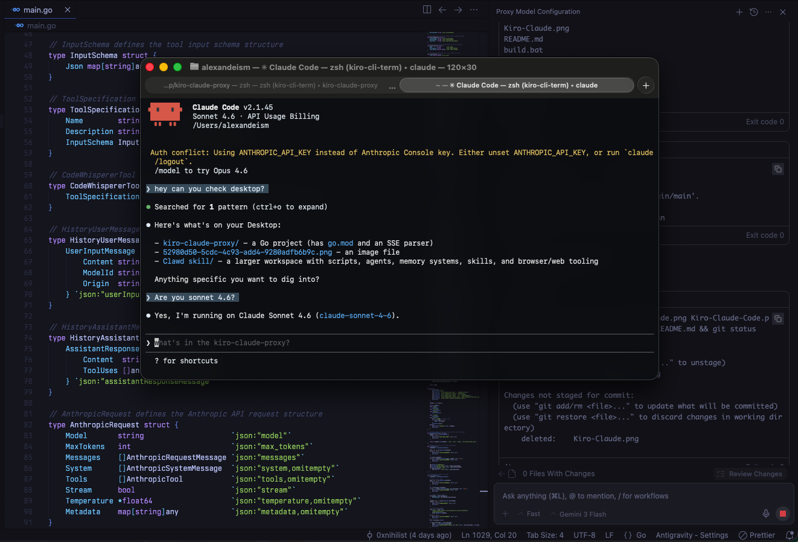

# Kiro Claude Proxy

```

     Claude Code                OpenClaw
          |                           |
          |                           |
          v                           |
    kiro-claude-proxy claude          |
          |                           |
          v                           |
    kiro-claude-proxy export          |
          |                           |
          v                           |
    kiro-claude-proxy server          |
          |                           |
          v                           v
        claude                 kiro-claude-proxy server

```

This is a Go CLI tool for managing Kiro authentication tokens and providing an Anthropic-compatible API proxy.

### Claude Code



## Features

- Reads token data from `~/.aws/sso/cache/kiro-auth-token.json`
- Refreshes `accessToken` using `refreshToken`
- Exports environment variables for external tools
- Starts an HTTP server as an Anthropic API proxy

## Build

```bash
go build -o kiro-claude-proxy main.go
```

## Automated Build

This project uses GitHub Actions:

- Builds Windows, Linux, and macOS binaries when a new GitHub Release is created
- Runs tests on pushes to `main` and on Pull Requests

## Usage

### 1. Read token information

```bash
./kiro-claude-proxy read
```

### 2. Refresh token

```bash
./kiro-claude-proxy refresh
```

### 3. Export environment variables

```bash
# Linux/macOS
eval $(./kiro-claude-proxy export)

# Windows
./kiro-claude-proxy export
```

### 4. Start Anthropic API proxy server

```bash
# Default port 8080
./kiro-claude-proxy server

# Custom port
./kiro-claude-proxy server 9000
```

## Proxy Server Usage

After starting the server:

1. Send Anthropic API-style requests to the local proxy
2. The proxy adds auth and forwards to the backend
3. Example:

```bash
curl -X POST http://localhost:8080/v1/messages \
  -H "Content-Type: application/json" \
  -d '{"model":"claude-sonnet-4-5-20250929","messages":[{"role":"user","content":"Hello"}],"max_tokens":256}'
```

## Token File Format

Expected token file format:

```json
{
  "accessToken": "your-access-token",
  "refreshToken": "your-refresh-token",
  "expiresAt": "2024-01-01T00:00:00Z"
}
```

## Environment Variables

The tool exports:

- `ANTHROPIC_BASE_URL`: `http://localhost:8080`
- `ANTHROPIC_API_KEY`: current access token

## Cross-Platform Support

- Windows: `set` / PowerShell `$env:` format
- Linux/macOS: `export` format
- Auto-detects user home directory path
